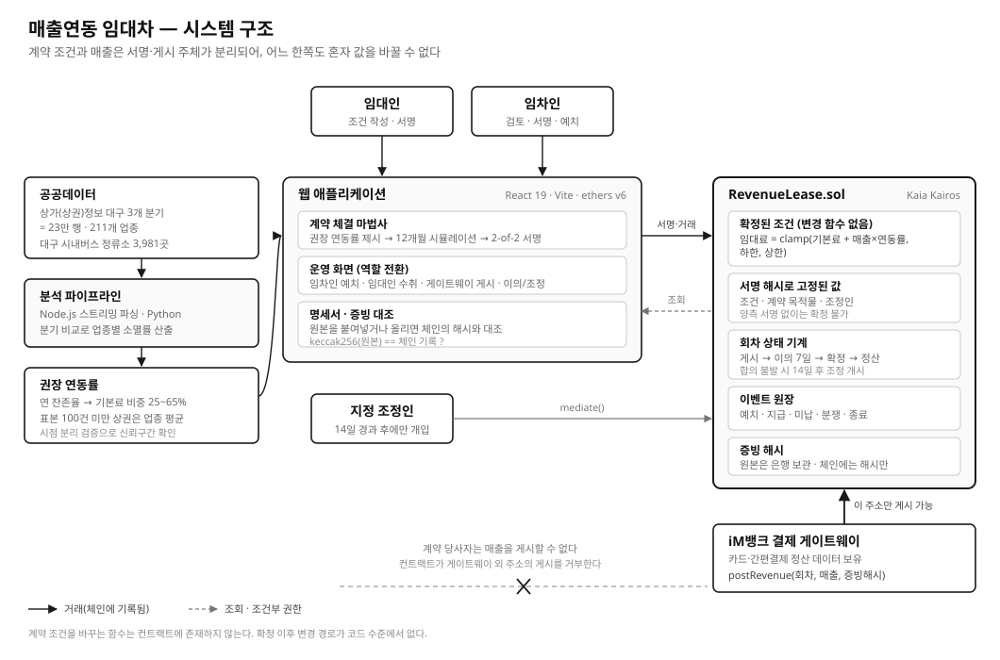

# 제안요약서 초안 (붙임4)

> 서식은 A4 5장 내외. 아래는 서식에 옮겨 넣을 원고다.
> 과제요약은 **500자 이내**라 글자수를 세어 맞췄다 (`node scripts/count-summary.js`).

- **과제명** 매출연동 임대차 — 골목상권 임대차의 블록체인 검증 인프라
- **공모분야** ❺ 블록체인 기반 신뢰 인프라
- **핵심 키워드** 스마트컨트랙트 / 매출연동 임대료 / 결제 게이트웨이 / 증빙 해시 검증

---

## 과제요약 (500자 이내)

대구 소규모 상가 공실률은 9.1%로 17개 시도 중 1위다. 임대인은 호가를 낮추면 담보가치가 함께 떨어져 못 내리고, 임차인은 매출을 모르는 상권에 고정 월세를 걸지 못한다. 양측이 0원을 택하는 교착이다. 해법인 매출연동 임대차는 백화점이 수십 년째 쓰는 방식이지만 골목상권에는 없다. 서로의 매출을 못 믿기 때문이다. 본 제안은 그 신뢰를 코드로 대체한다. 임대료 = 기본료 + 매출×연동률, 하한과 상한 사이로 고정하는 산정식을 스마트컨트랙트에 새기고, 매출은 은행 결제 게이트웨이만 게시할 수 있게 못 박는다. 계약 조건과 목적물은 양측 서명 해시로 확정되어 사후 변경이 불가능하며, 산정·정산·미납·분쟁이 전부 온체인 이벤트로 남는다. 정산 원본은 은행이 보관하고 해시만 체인에 올려, 누구든 원본을 넣어 진위를 대조할 수 있다. 대구 상가정보 3개 분기 23만 건을 분석해 업종별 권장 연동률을 산출했다.

---

## 1. 제안내용의 목적 및 필요성

### 1-1. 문제 정의

대구의 **소규모 상가 공실률은 9.1%로 17개 시도 중 1위**다(2025.3Q). 동성로 23.3%, 서문시장·청라언덕 일대는 34%를 넘는다. 상업용 부동산 투자수익률은 0.32%로 전국 평균 0.57%의 절반이다. 2024년 대구는 **전국에서 유일하게 순창업이 마이너스**(-2,287개)였다.

빈 점포가 이만큼 쌓였는데도 임대료는 내려가지 않는다. 시장이 고장 난 것이 아니라, 양측 모두에게 합리적인 선택이 교착을 만든다.

| | 왜 움직이지 못하는가 |
|---|---|
| 임대인 | 호가를 낮추면 **담보가치가 함께 떨어진다.** 대출 한도와 연체 판정이 걸려 있어 공실이 낫다 |
| 임차인 | 매출을 알 수 없는 상권에 **고정 월세를 미리 걸 수 없다.** 손익분기가 계산되지 않는다 |

둘 다 0원을 택하고 있다. 임대인은 임대료 수입 0원, 임차인은 창업 자체를 포기한다.

### 1-2. 타깃

- **1차** 대구 구도심(중구 동성로·서문시장·청라언덕) 공실 상가의 임대인과 신규 창업 임차인
- **2차** 두 사람 사이에 들어가는 **iM뱅크** — 임차인의 카드·간편결제 정산을 이미 보고 있는 유일한 제3자

### 1-3. 핵심 솔루션

매출연동 임대차 자체는 새로운 것이 아니다. 백화점·아울렛이 수십 년째 쓰는 방식이다. 골목상권에 없는 이유는 금융 상품이 없어서가 아니라 **양측이 서로의 매출을 못 믿기 때문**이다.

임대료를 이렇게 나눈다.

```
임대료 = clamp( 기본료 + 매출 × 연동률 , 하한 , 상한 )
```

공실기에는 하한까지 내려가 임차인이 버티고, 장사가 되면 상한까지 올라가 임대인이 회수한다. 임대인은 호가를 낮추지 않았으므로 담보가치가 유지되고, 임차인은 매출이 없는 달에 고정비로 무너지지 않는다.

이 계약이 성립하려면 **매출이라는 숫자를 양측이 다투지 않아야 한다.** 그래서 매출을 계약 당사자가 신고하지 않는다. 임차인의 결제 데이터를 이미 보고 있는 은행이 게이트웨이로서 직접 체인에 게시하고, 컨트랙트는 그 주소 외의 게시를 거부한다.

### 1-4. 왜 블록체인인가 — 못 믿는 것과 그 검증 장치

DB로 만들면 "그 DB를 왜 믿나"로 되돌아온다. 못 믿는 항목은 정확히 여섯이고, 각각에 검증 장치가 대응한다.

| 못 믿는 것 | 검증 장치 | 구현 |
|---|---|---|
| 무엇을 빌리는 계약인가 | 목적물을 양측 서명 해시에 포함 — 확정 후 변경 불가 | `activate()` 가 목적물 문자열을 받아 저장 |
| 임차인이 매출을 축소 신고할까 | 게시 주체를 은행으로 고정, 그 외 주소는 거부 | `postRevenue()` 게이트웨이 전용 |
| 임대인이 산정식을 사후에 바꿀까 | 조건을 2-of-2 서명 해시로 확정. **변경 함수가 ABI에 존재하지 않음** | `activate()` 의 서명 검증 |
| 은행이 준 정산 원본이 진짜인가 | 원본은 은행이 보관, 해시만 체인에 기록 | `postRevenue(period, revenue, proof)` |
| 정산이 제대로 됐나 | 예치·지급·미납·분쟁이 전부 이벤트로 남음 | 온체인 원장 + 활동 피드 |
| 그 해시가 진짜 그 원본의 것인가 | 원본을 넣으면 체인의 해시와 대조 | 명세서 화면의 증빙 대조 |

이것이 공모주제 ❺의 "**자산·거래·증명서 블록체인 검증 인프라**"에 해당한다. 매출연동 임대차는 그 인프라 위에서 비로소 성립하는 응용이다.

### 1-5. 주요 기능

**① 계약 체결 — 근거 있는 조건을 양측이 서명해 확정한다**

대구 상가정보 3개 분기를 분석해 산출한 **업종별 권장 연동률**을 제시한다. 임대인이 조건을 쓰고, 임차인이 12개월 시뮬레이션으로 검토한 뒤, 양측이 서명해야 계약이 확정된다. 목적물(매장명·주소·면적·용도)도 같은 해시에 들어가 서명 대상이 된다.

**② 매출 게시와 자동 정산 — 은행만 쓰고, 컨트랙트가 계산한다**

게이트웨이(은행)가 월 매출과 정산 원본 해시를 게시하면 컨트랙트가 산정식대로 임대료를 계산한다. 임차인이 미리 예치한 금액에서 임대인에게 지급되고, 모자라면 미납으로 남아 보증금에서 정산된다.

**③ 이의와 조정 — 기한이 코드로 강제된다**

임차인은 게시 후 7일 안에 이의를 제기할 수 있고, 그 기간이 지나면 확정된다. 합의가 안 되면 14일 뒤 지정 조정인이 개입한다. 이 기한은 운영 규정이 아니라 컨트랙트 조건이다.

**④ 명세서와 증빙 대조 — 원본 없이 검증한다**

계약 요약과 월별 정산 명세서를 인쇄용으로 제공한다. 같은 화면에서 원본을 붙여넣거나 파일로 올리면 체인에 기록된 해시와 대조해 일치 여부를 알려 준다. 주소 한 글자만 달라도 불일치가 뜬다.

---

## 2. 구조 및 기술

### 2-1. 시스템 구조도



> 원본은 `docs/assets/architecture.svg`. 서식이 SVG를 받지 않으면 브라우저에서 열어 PNG로 저장해 넣는다.

### 2-2. 기술 스택

| 구분 | 사용 기술 | 선택 이유 |
|---|---|---|
| 스마트컨트랙트 | Solidity 0.8.24, Hardhat 2.29 (외부 라이브러리 없음) | 산정식과 기한을 코드로 고정 |
| 체인 | Kaia Kairos 테스트넷 (chain ID 1001) | 국내 원화 스테이블 연계와 수수료 구조 |
| 프런트엔드 | React 19, Vite 8, ethers v6 | 지갑 설치 없이 브라우저에서 서명·거래 |
| 배포 | Render 정적 사이트 | 서버 없는 정적 번들 — 심사 시연 중 슬립 없음 |
| 데이터 분석 | Node.js (스트리밍 zip 파싱), Python 3 / scikit-learn | 340MB 분기 스냅샷 3개를 메모리 초과 없이 처리 |
| 테스트 | Hardhat + Chai, 27개 | 자금 잠김·권한·기한 경계를 회귀 검증 |

### 2-3. 사용 데이터셋

| 데이터 | 출처 | 규모 | 용도 |
|---|---|---|---|
| 소상공인시장진흥공단 **상가(상권)정보** | 공공데이터포털 | 대구 3개 분기(2025.06 / 2025.12 / 2026.03), **23만 행** | 업종별 소멸률 → 권장 연동률 산출 |
| **대구 시내버스 정류소** 위치정보 | 공공데이터포털 15050946 | 3,981곳 | 유동량 대리변수 (검증 후 기각) |
| 상업용부동산 임대동향조사 | 한국부동산원 | 대구 소규모 상가 공실률 | 문제 정의 근거 |

권장 연동률은 업종별 연 잔존율(5~95 백분위 80.7~98.0%)을 기본료 비중 25~65%로 매핑해 산출했다. 211개 업종에 값이 있다.

---

## 3. 제안내용의 차별성

| | 기존 | 본 제안 |
|---|---|---|
| **매출 신고 주체** | 임차인 자진 신고 (백화점은 POS 직결) | **은행 결제 게이트웨이가 직접 게시**, 당사자는 쓸 수 없음 |
| **산정식 변경** | 특약으로 사후 조정 가능 | 변경 함수가 **ABI에 존재하지 않음** |
| **분쟁 기한** | 운영 규정·관행 | 컨트랙트 조건 (이의 7일, 조정 14일) |
| **증빙 검증** | 원본을 상대에게 넘겨야 확인 | **해시만 공개**, 원본 없이 제3자 검증 |
| **연동률 근거** | 협상력 | 대구 23만 건 실측 소멸률 |
| **적용 범위** | 백화점·아울렛 (POS 직결 대형 임대인) | **골목상권 개별 점포** |

기존 블록체인 부동산 서비스는 대부분 **등기·소유권 토큰화**에 머문다. 본 제안은 소유가 아니라 **계약 이행 과정**을 검증 대상으로 삼는다는 점이 다르다.

### 정직하게 밝히는 한계

- 공식 폐업 플래그가 없어, 직전 스냅샷에서 상가업소번호가 사라진 것을 소멸로 추정했다. 이전·상호변경·휴업이 섞여 있다.
- 현재 결제 게이트웨이는 시연용 서명 계정이다. 실제 PG 연동에는 은행 내부 시스템과의 중계 서버가 필요하다.
- 데모 서명 키가 공개 번들에 포함된다. 심사위원이 지갑 설치 없이 세 역할을 오가게 하려는 의도이며, 테스트넷 전용이다.

---

## 4. 기대효과

**① 공실 해소 — 임대인이 담보가치를 지키면서 내려올 수 있다**

호가(기본료+상한)를 유지한 채 실질 부담만 낮추므로, 임대인이 감정평가와 대출 한도를 훼손하지 않고 계약할 수 있다. 지금 교착의 원인을 그대로 풀어낸다.

**② 창업 생존율 — 고정비가 매출을 따라간다**

대구 외식업 폐업률은 21.71%로 전국 공동 1위다. 매출 없는 달에 고정 월세로 무너지는 경로를 하한선까지 낮춰 준다.

**③ 은행의 새로운 위치 — 정산 데이터가 신뢰의 근거가 된다**

iM뱅크가 이미 보유한 가맹점 정산 데이터가 임대차 계약의 기준값이 된다. 게이트웨이 수수료, 매출 흐름 기반 소상공인 여신, 임대인 대상 임대료 유동화로 확장된다.

**④ 검증 인프라의 재사용**

"조건을 서명으로 고정하고, 제3자가 값을 게시하고, 원본 없이 해시로 검증한다"는 구조는 임대차에 한정되지 않는다. 프랜차이즈 로열티, 위탁판매 수수료, 공동사업 정산에 같은 컨트랙트 형태로 적용된다.

---

## 5. 기술 검증 자료 (자유 기재)

### 5-1. AI 적용 가능성 검증 — 시도하고, 기각했다

대회가 AI·블록체인인 만큼 점포 단위 폐업 예측 모델을 붙이려 했다. **성립하지 않았다.** 23만 행으로 시점 분리 검증(과거 구간 학습 → 다음 구간 예측)을 한 결과다.

| 방법 | ROC-AUC |
|---|---|
| 업종 평균 (현재 방식) | 0.604 |
| 로지스틱 회귀 | 0.600 |
| 그래디언트 부스팅 | 0.603 |

세 방법이 같다. 피처를 단독으로 뜯어보면 이유가 나온다.

| 피처 | 단독 AUC |
|---|---|
| 업종 소분류 | 0.604 |
| 층수 (결측 48.6%) | 0.526 |
| 행정동 | 0.523 |
| 반경 200m 동종업종 수 | 0.514 |
| 버스 접근성 3종 | 0.500~0.502 |

**상가정보에는 매출·임대료·개업일·사업자 특성이 없다.** 폐업을 가르는 변수가 데이터에 없다. 대구에 개방된 유동인구 데이터가 없어 버스 정류소 3,981곳을 대리변수로 붙였으나 역시 0.50이었다.

억지로 모델을 붙이는 대신 검증 자체를 결과물로 남겼다. 화면의 "업종 근거" 탭에서 이 수치를 그대로 펼쳐 볼 수 있다.

### 5-2. 같은 검증에서 제품 결함을 찾아 고쳤다

상권×업종 세분화가 다음 분기에 재현되지 않았다.

| 단위 | 학습구간과 검증구간의 소멸률 상관 |
|---|---|
| 업종 (표본 30개 이상, 211개) | 0.571 |
| 상권×업종 (표본 30개 이상, 574개) | **0.291** |
| 상권×업종 (표본 100개 이상, 46개) | 0.624 |

화면이 보여주던 "상권별 편차" 상당수가 표본 노이즈였다. 표본 100개 미만 조합은 업종 평균으로 대체하고 이유를 표시하도록 고쳤다.

### 5-3. 컨트랙트 안전성

테스트 27개가 자금 잠김·권한·기한 경계를 검증한다. 특히 다음 두 경로는 자금이 컨트랙트에 갇히는 결함이어서 별도로 막았다.

- 이미 정산된 회차에 추가 예치가 들어가는 경로
- 게시·분쟁 중인 회차를 남긴 채 계약을 종료해 예치금이 잠기는 경로

---

## 제출 전 확인

- [ ] 붙임1 참가신청서 — 공모주제 **❺** 하나만 표시
- [ ] 붙임2 참가서약서
- [ ] 붙임3 개인정보 동의서 — **팀원 전원**
- [ ] 붙임1~3 직인 날인 스캔 후 **1개 파일**로 병합
- [ ] 붙임4 제안요약서 — A4 5장 내외, 구조도 이미지 포함
- [ ] 프로토타입 ZIP 또는 시연영상
- [ ] 공개 URL 동작 확인 (Kairos 배포 후)
